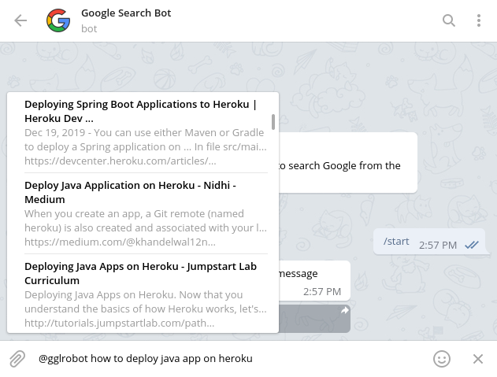

# Google Search Bot

Google Search Bot is a [Telegram bot](https://core.telegram.org/bots) project that searches from the Web. It crawls search results from Google and passes the first 50 results to the Telegram bot as [InlineQueryResult](https://core.telegram.org/bots/api#inlinequeryresult).

## Table of Contents

- [Screenshot](#screenshot)
- [Usage](#usage)
- [Getting Started](#getting-started)
  * [Prerequisite (Linux):](#prerequisite--linux--)
    + [Install Java Development Kit](#install-java-development-kit)
    + [Set environment variables](#set-environment-variables)
  * [Running the bot](#running-the-bot)
- [Contributing](#contributing)
- [Thanks to](#thanks-to)
- [License](#license)

## Screenshot



## Usage

To search the Web type `@BotUsername something` in the Telegram message field.

## Getting Started

To run this bot, you will need 

- JDK 8 or later
- A little bit idea about Linux. (Environment variables, running a command etc.)

### Prerequisite (Linux):

#### Install Java Development Kit

For Ubuntu,

```bash
sudo apt install default-jre default-jdk
```

For Fedora,

```bash
sudo dnf install java-latest-openjdk java-latest-openjdk-devel
```

For Arch Linux,

```bash
sudo pacman -S jre-openjdk jdk-openjdk
```

You may find JDK for other distributions as well. Install them accordingly.

#### Set environment variables

Set these environment variable

```bash
export TELEGRAM_BOT_API_TOKEN=<YOUR_BOT_API_TOKEN>
export TELEGRAM_BOT_USERNAME=<BOT_USERNAME>
export ADMIN_USERNAME=<YOUR_TELEGRAM_USERNAME>
```

If you want to use this bot personally, set

```bash
export ADMIN_ONLY_MODE=TRUE
export ADMIN_USER_ID=<YOUR_TELEGRAM_USERID>
```

### Running the bot

Clone this repository

```bash
git clone https://github.com/AlShakib/GoogleSearchBot.git
```

Change current directory to the repository

```bash
cd GoogleSearchBot
```

Build a jar

```bash
./gradlew GoogleSearchBot
```

Now, run the jar

```bash
java -jar build/libs/GoogleSearchBot-*.jar
```

## Contributing

Pull requests are welcome. For major changes, please open an issue first to discuss what you would like to change.

## Thanks to

- [TelegramBots](https://github.com/rubenlagus/TelegramBots)
- Project Icon is made by [Freepik](https://www.flaticon.com/authors/freepik) from [www.flaticon.com](https://www.flaticon.com)

## License

[GNU General Public License v3.0](LICENSE)

Copyright © 2020 [Al Shakib](https://alshakib.dev)
